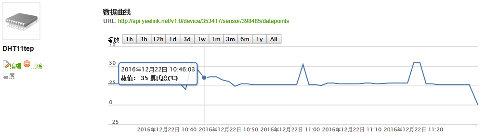
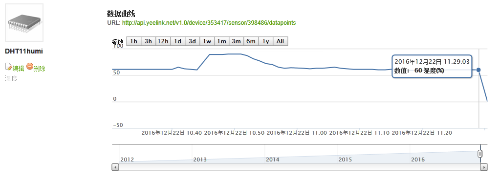

# Arduino-and-RaspberryPi 
#Digital Clock Design 
Arduino, DHT11, DS1302, LCD12864, LED, Button, Resistor, Buzzer Hummer 
#Circuit Connection 

 

#Raspberry Pi 
#Real-time Monitoring 
The data is uploaded to Yeelink 
 
 

